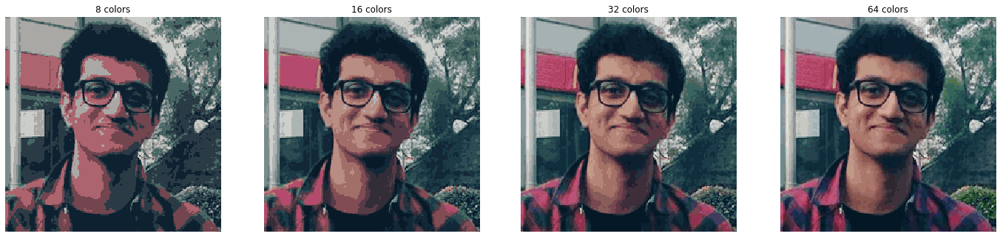

# 🎨 Color Quantization using K-Means Clustering

This project demonstrates color quantization on images using the K-Means clustering algorithm. It also includes a basic K-Means example on the Iris dataset.

<!-- Option 1: Base64 embedded image -->
<!-- Uncomment and replace YOUR_BASE64_STRING to embed image -->




<!-- Option 2: Use GIFs from the gif/ folder -->


## 📂 Project Structure

```plaintext
.
├── .ipynb_checkpoints/
├── gif/
│   ├── Clusters-3D.gif
│   └── Clusters-3D-500.gif
├── Color Quantization using K-Means Clustering.ipynb
├── KMeansClustering.ipynb
└── README.md
```


## 📘 Notebooks Overview

### 📒 Color Quantization using K-Means Clustering.ipynb

This notebook applies **K-Means clustering** to perform **color quantization** on an image. The key steps are:

- **Image Loading & Normalization**: Loads an image from a URL and normalizes the pixel values.
- **Random Quantization**: Demonstrates color quantization by randomly selecting a color palette and assigning the closest color to each pixel.
- **K-Means Quantization**: Applies K-Means clustering to the pixel colors of the image, reducing the number of unique colors to a specified number (e.g., 10 colors).
- **Reconstruction**: Rebuilds and visualizes the quantized image from the cluster centroids and labels.
- **Comparison for Different K**: Visualizes the impact of different numbers of clusters (K values) on image quantization.

Key Features:
- **Image Preprocessing**: Converts the image into a 2D array suitable for clustering.
- **Color Quantization**: Reduces the number of unique colors in an image to improve compression and visual abstraction.
- **K-Means Clustering**: Applies K-Means clustering to group similar colors and reconstruct the quantized image.
- **Visualization**: Displays the original image, random quantized image, and K-Means quantized image for different values of K.
- **Interactive Visualization**: Allows exploring different values of K (number of clusters) and visualizing their effect on the color quantization result.

---

### 📘 KMeansClustering.ipynb


<!---->


This notebook applies **K-Means clustering** to the **Iris dataset** and uses **t-SNE** for dimensionality reduction. It demonstrates how to perform unsupervised learning by clustering the dataset into different species categories based on their features.

Key features:
- **Dataset Loading**: Loads the Iris dataset using `scikit-learn` and displays the data's shape.
- **Dimensionality Reduction**: Uses **t-SNE** to reduce the 4-dimensional dataset to 2D and 3D for better visualization and clustering performance.
- **K-Means Clustering**: Applies the **K-Means clustering** algorithm to group the dataset into 3 clusters (since the Iris dataset contains 3 species of flowers).
- **2D Visualization**: Plots the clustered data in a 2D space using t-SNE to visualize how well the K-Means algorithm has grouped the data points.
- **3D Visualization**: Uses **3D visualization** for a more interactive exploration of the clusters, allowing for better insights into the distribution of data.
- **Rotating 3D Plot**: Provides an interactive rotating plot to view the 3D clustering results from different angles for a better understanding of the data separation.


Useful for understanding the intuition behind clustering before applying it to images.

## 🔧 Requirements

- Python 3.x
- `matplotlib`
- `scikit-learn`
- `numpy`
- `PIL` or `Pillow` (for image loading)
- `imageio` (for GIF creation)
